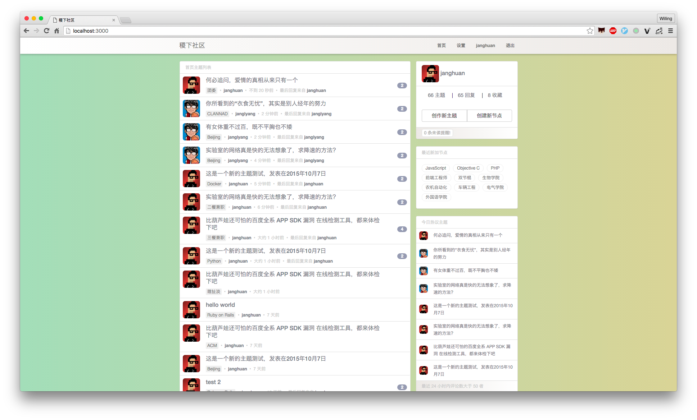
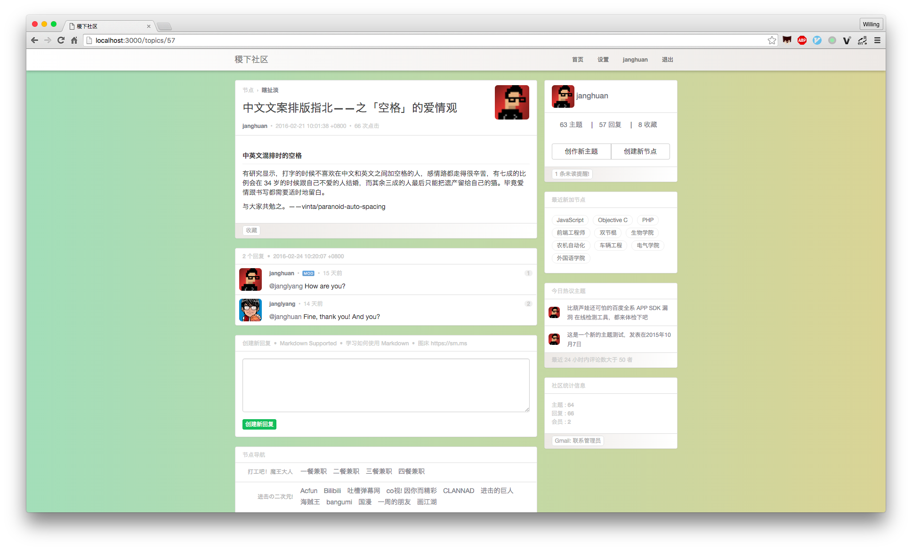
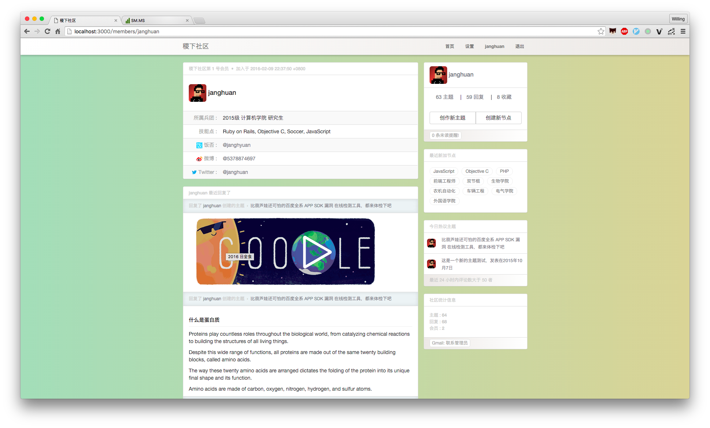

# Yet another forum

在学习完 [Ruby on Rails Tutorials](https://railstutorial-china.org/book/) 后，自己对 Rails 的理解终于成功从 **hello world** 阶段进阶。所以该项目只是一个试验性的练习项目，算是对该阶段的一个学习总结。UI 拷贝自 [v2ex](https://v2ex.com)

## 项目截图







## 通知系统的实现 - Notification System

### 原理
`@username` 此种形式的发送消息方式好像是从 Twitter 开始流行起来的。所以在 Topic（主题） 和 Reply（回复） 被存入数据库之前要先进行过滤，如果发现有此种形式 `@username` 就将 `username` 提取出来并在 `Users` 表中进行查找。如果找到相应的用户，就将发送消息的用户、主题或者回复相关的信息发送给 `username` 对应的用户。

### 代码实现

**topic.rb**
```ruby
def send_notification
	body.scan /@\w+/ do |m|
		member_name = m[1..-1]
		if member = Member.find_by(name: member_name)
			member.notifications.create(topic_id: id, sender_id: self.member.id, unread: true)
		end
	end
end
```

**reply.rb**
```ruby
def send_notification
	body.scan /@\w+/ do |m|
		member_name = m[1..-1]
		if member = Member.find_by(name: member_name)
			member.notifications.create(topic_id: topic.id, sender_id: self.member.id, reply_id: id, unread: true)
		end
	end
end
```
## 主题按照其最新的回复时间进行排序

有最新回复的主题总是被排到首页第一位。刚开始构思这个实现思路时，总是把思维固定在 `topic` `reply` 两个不同的表中，而没有想到给 `topic` 添加一个 `last_modified` 字段，在主题创建、有最新回复时更新这个字段就可以按照最新回复排序。

在新主题创建完毕后，就要更新 `last_modified` 字段，最开始我想利用 `topic` 的 `created_at` 来更新 `last_modified`，对回调函数的不熟悉，先采用了获取当前 utc 时间的方式来更新该字段。

**topic.rb**
```ruby
before_save :update_last_modified
...
...
def update_last_modified
	self.last_modified = Time.now.utc
end
```

## 楼层与主题点击数统计

**楼层**

在用户回复主题提交时，将该主题的回复总数加 1，用一个 hidden_field_tag 提交到 params 中，从而提交该回复的楼层数。

**点击数**

每一次用到 `replies#index` （处理主题的 show 页面）时都要在 index 动作里更新主题的 clickcount 字段。